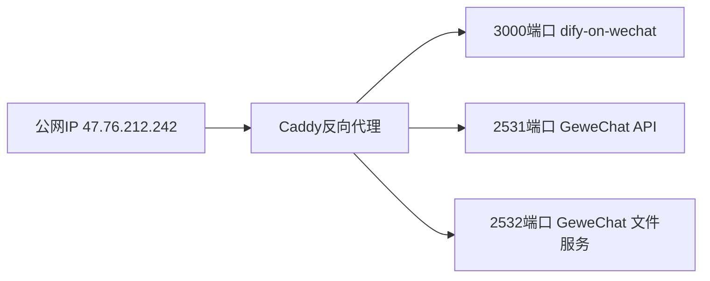

# GitHub 项目「dify-on-wechat + Gewechat」部署指南（本地 + VPS）

## 一、部署目标：

实现 [dify-on-wechat](https://github.com/hanfangyuan4396/dify-on-wechat) 和 [Gewechat](https://github.com/Devo919/Gewechat) 两个项目在本地（Windows 11）开发和测试后，成功迁移至香港VPS（Debian 12，IP地址：`47.76.212.242`）运行，最终实现企业微信与微信的智能AI助理功能。

------

## 二、详细环境信息确认：

| 环境类别       | 环境信息                                                     |
| -------------- | ------------------------------------------------------------ |
| 本地操作系统   | Windows 11                                                   |
| 本地开发工具   | Git（含 GitHub Desktop）、VS Code、Docker Desktop、WSL2      |
| 本地代理方式   | 使用 mihomo (Clash Premium) 科学上网，连接香港或新加坡服务器【已确认clashF.yml配置】 |
| VPS 系统       | Debian 12                                                    |
| VPS 远程工具   | SSH 已配置，可用 WindTerm，尝试使用 VS Code 的远程连接功能   |
| VPS Docker环境 | 已安装 Docker 和 Docker Compose，定期更新                    |
| VPS 端口情况   | 已开放：3000（应用端口），80（HTTP），443端口（被 hysteria2 占用），Caddy 部署 `/var/www/html/clashF.yml` |
| 其他功能       | 计划学习 Caddy 反向代理                                      |

------

## 三、操作步骤详细清单：

### 准备

#### 1. 账号注册

进入[Dify App](https://cloud.dify.ai) 官网注册账号，创建一个应用并发布，然后在概览页面创建保存api密钥，同时记录api url，一般为https://api.dify.ai/v1

> 创建了 工作流Workflow"GeminiForWechat"用于测试，app-j32DUs5s7X4kISr566rywEpI。

#### 2.运行环境

支持 Linux、MacOS、Windows 系统（可在Linux服务器上长期运行)，同时需安装 `Python`。

python推荐3.8以上版本，已在ubuntu测试过3.11.6版本可以成功运行。

##### **(1) 克隆项目代码：**

```bash
git clone https://github.com/hanfangyuan4396/dify-on-wechat
cd dify-on-wechat/
```

##### **(2) 安装核心依赖 (必选)：**

> 能够使用`itchat`创建机器人，并具有文字交流功能所需的最小依赖集合。

```bash
pip3 install -r requirements.txt  # 国内可以在该命令末尾添加 "-i https://mirrors.aliyun.com/pypi/simple" 参数，使用阿里云镜像源安装依赖
```

##### **(3) 拓展依赖 (可选，建议安装)：**

```bash
pip3 install -r requirements-optional.txt # 国内可以在该命令末尾添加 "-i https://mirrors.aliyun.com/pypi/simple" 参数，使用阿里云镜像源安装依赖
```

> 如果某项依赖安装失败可注释掉对应的行再继续

### 配置

配置文件的模板在根目录的`config-template.json`中，需复制该模板创建最终生效的 `config.json` 文件：

```bash
cp config-template.json config.json
```

然后在`config.json`中填入配置，以下是对默认配置的说明，可根据需要进行自定义修改（如果复制下方的示例内容，请**去掉注释**, 务必保证正确配置**dify_app_type**）：

```bash
# dify config.json文件内容示例
{ 
  "dify_api_base": "https://api.dify.ai/v1",    # dify base url
  "dify_api_key": "app-j32DUs5s7X4kISr566rywEpI",                    # dify api key
  "dify_app_type": "chatbot",                   # dify应用类型 chatbot(对应聊天助手)/agent(对应Agent)/workflow(对应工作流)，默认为chatbot
  "dify_convsersation_max_messages": 5,         # dify目前不支持设置历史消息长度，暂时使用超过最大消息数清空会话的策略，缺点是没有滑动窗口，会突然丢失历史消息，当设置的值小于等于0，则不限制历史消息长度
  "channel_type": "gewechat",                   # 通道类型，当前为个人微信，注意这里使用gewechat而非wx(itchat)
  "model": "dify",                              # 模型名称，当前对应dify平台
  "single_chat_prefix": [""],                   # 私聊时文本需要包含该前缀才能触发机器人回复
  "single_chat_reply_prefix": "",               # 私聊时自动回复的前缀，用于区分真人
  "group_chat_prefix": ["@bot"],                # 群聊时包含该前缀则会触发机器人回复
  "group_name_white_list": ["ALL_GROUP"],       # 机器人回复的群名称列表
  "image_recognition": true,                    # 是否开启图片理解功能，需保证对应的dify应用已开启视觉功能
  "speech_recognition": true,                   # 是否开启语音识别
  "voice_reply_voice": true,                    # 是否使用语音回复语音
  "always_reply_voice": false,                  # 是否一直使用语音回复
  "voice_to_text": "dify",                      # 语音识别引擎
  "text_to_voice": "dify",                      # 语音合成引擎
  "gewechat_token": "",                         # 首次登录可留空,自动获取
  "gewechat_app_id": "",                        # 首次登录可留空,自动获取
  "gewechat_base_url": "http://本机ip:2531/v2/api",  # gewechat服务API地址
  "gewechat_callback_url": "http://本机ip:9919/v2/api/callback/collect", # 回调地址
  "gewechat_download_url": "http://本机ip:2532/download" # 文件下载地址
}
```

上述示例文件是个人微信对接dify的极简配置，详细配置说明需要查看config.py，注意**不要修改config.py中的值**，config.py只是校验是否是有效的key，最终**生效的配置请在config.json修改**。

##### 私聊触发前缀 (single_chat_prefix)
```python
"single_chat_prefix": [""],
```

- 这个配置项是一个列表，用于设置在私聊时需要包含哪些前缀才能触发机器人回复
- 当前设置为 [""] （空字符串），意味着在私聊中 不需要任何特定前缀 ，机器人会对所有消息进行回复
- 如果你想要设置特定前缀，可以改为例如 ["机器人", "/bot"] ，这样只有消息以"机器人"或"/bot"开头时才会触发回复
##### 私聊回复前缀 (single_chat_reply_prefix)
```python
"single_chat_reply_prefix": "",
```

- 这个配置项设置机器人在私聊中回复时会自动添加的前缀
- 当前设置为空字符串，意味着机器人回复不会添加任何前缀
- 如果设置为例如 "[AI]:" 那么机器人的每条回复都会以 "[AI]:" 开头
##### 群聊触发前缀 (group_chat_prefix)
```python
"group_chat_prefix": ["@bot"],
```

- 这个配置项是一个列表，用于设置在群聊中需要包含哪些前缀才能触发机器人回复
- 当前设置为 ["@bot"] ，意味着在群聊中，消息需要包含 "@bot" 才会触发机器人回复
- 你可以根据需要修改为其他前缀，例如 ["@小助手", "机器人"]
##### 如何停止私聊中的自动回复
如果你想要停止私聊中机器人对所有消息的自动回复，你需要修改 single_chat_prefix 配置项，设置一个非空的前缀，例如：

```python
"single_chat_prefix": ["/bot"],
```

这样设置后，机器人只会对以 "/bot" 开头的消息进行回复，而不是回复所有消息。

中括号 [] 是Python中列表的语法，你不需要在实际对话中输入中括号，只需要输入你设置的前缀内容即可。

### 运行

#### 1.本地运行

如果是开发机 **本地运行**，直接在项目根目录下执行：

```bash
python3 app.py                                    # windows环境下该命令通常为 python app.py
```

终端输出二维码后，使用微信进行扫码，当输出 "Start auto replying" 时表示自动回复程序已经成功运行了（注意：用于登录的微信需要在支付处已完成实名认证）。扫码登录后你的账号就成为机器人了，可以在微信手机端通过配置的关键词触发自动回复 (任意好友发送消息给你，或是自己发消息给好友)。

#### 2.服务器部署

使用nohup命令在后台运行程序：

```bash
nohup python3 app.py & tail -f nohup.out          # 在后台运行程序并通过日志输出二维码
```

扫码登录后程序即可运行于服务器后台，此时可通过 `ctrl+c` 关闭日志，不会影响后台程序的运行。使用 `ps -ef | grep app.py | grep -v grep` 命令可查看运行于后台的进程，如果想要重新启动程序可以先 `kill` 掉对应的进程。日志关闭后如果想要再次打开只需输入 `tail -f nohup.out`。此外，`scripts` 目录下有一键运行、关闭程序的脚本供使用。

> **多账号支持：** 将项目复制多份，分别启动程序，用不同账号扫码登录即可实现同时运行。

> **特殊指令：** 用户向机器人发送 **#reset** 即可清空该用户的上下文记忆。

#### 3.Docker部署

⚠️使用`docker`或者`docker-compose`部署时，**必须先拉取最新源码**，否则会报错⚠️

```bash
cd dify-on-wechat/docker       # 进入docker目录
cp ../config-template.json ../config.json
docker compose up -d           # 启动docker容器
docker logs -f dify-on-wechat  # 查看二维码并登录
```

### 阶段一：本地 Windows 11 环境部署

#### 1. Docker环境准备

确保Docker Desktop已正确安装并启动。WSL2集成已开启。

#### 2. 网络验证

检查Docker网络配置，确保容器间通信正常：

```bash
# 查看Docker网关IP地址（重要参数）
docker network inspect bridge --format '{{range .IPAM.Config}}{{.Gateway}}{{end}}'

# 查看本机局域网IP地址（需用于配置文件中的"本机ip"）
ipconfig

# 其他容器网络诊断命令
docker exec -it dify-on-wechat ip addr show eth0
```

#### 3. 部署 GeweChat 服务

```bash
# 从阿里云镜像仓库拉取(国内)
docker pull registry.cn-chengdu.aliyuncs.com/tu1h/wechotd:alpine
docker tag registry.cn-chengdu.aliyuncs.com/tu1h/wechotd:alpine gewe

# 创建数据目录并启动服务
mkdir -p gewechat/data  
docker run -itd -v ./gewechat/data:/root/temp -p 2531:2531 -p 2532:2532 --restart=always --name=gewe gewe
```

#### 4. 配置 dify-on-wechat

创建 `config.json` 文件，注意以下关键配置：

```json
{
    "channel_type": "gewechat",  
    "gewechat_token": "",        
    "gewechat_app_id": "",       
    "gewechat_base_url": "http://192.168.1.X:2531/v2/api",  
    "gewechat_callback_url": "http://192.168.1.X:9919/v2/api/callback/collect", 
    "gewechat_download_url": "http://192.168.1.X:2532/download" 
}
```

⚠️ 确保 IP 地址使用本机局域网 IP，不能使用 `127.0.0.1` 或 `localhost`。

#### 5. 确认服务运行与连通性

```bash
# 检查 GeweChat 服务状态
docker logs -f gewe

# 测试服务可访问性
curl http://192.168.1.X:2531/v2/api/info
```

#### 6. 运行 dify-on-wechat

```bash
# 直接运行
python app.py

# 或使用Docker运行
docker run -itd -v ./config.json:/app/config.json -p 9919:9919 dify-on-wechat

# 使用自定义环境变量的Docker运行方式
docker run -d --name dify-wechat \
  -p 3000:3000 -p 2531:2531 \
  -e GEWECHAT_BASE_URL="http://host.docker.internal:2531/v2/api" \
  -v ./config.json:/app/config.json dify-on-wechat
```

------

### 阶段二：远程 VPS 部署（Debian 12 环境）

#### 1. 远程连接服务器：

使用 VS Code SSH 远程连接或 WindTerm 连接 VPS:

```bash
ssh root@47.76.212.242
```

#### 2. 更新系统软件包：

```bash
apt update && apt upgrade -y
```

#### 3. 网络架构规划

由于 443 端口已被 hysteria2 占用，需要使用 Caddy 反向代理实现以下架构：



#### 4. 准备 Docker 环境

```bash
# 创建项目目录
mkdir -p /root/dify-bot
cd /root/dify-bot

# 准备持久化数据目录
mkdir -p data/gewechat
mkdir -p data/dify
```

#### 5. 创建 docker-compose.yml

创建 `docker-compose.yml` 文件，内容如下：

```yaml
version: '3'

services:
  gewechat:
    image: registry.cn-chengdu.aliyuncs.com/tu1h/wechotd:alpine
    container_name: gewechat
    restart: always
    ports:
      - "2531:2531"
      - "2532:2532"
    volumes:
      - ./data/gewechat:/root/temp

  dify-wechat:
    image: dify-on-wechat:latest
    container_name: dify-wechat
    restart: always
    ports:
      - "9919:9919"
    volumes:
      - ./config.json:/app/config.json
    depends_on:
      - gewechat
```

#### 6. 准备配置文件

创建 `config.json` 文件，注意以下关键配置：

```json
{
    "dify_api_base": "https://api.dify.ai/v1",
    "dify_api_key": "app-j32DUs5s7X4kISr566rywEpI",
    "dify_app_type": "chatbot",
    "channel_type": "gewechat",
    "gewechat_token": "",
    "gewechat_app_id": "",
    "gewechat_base_url": "http://gewechat:2531/v2/api",
    "gewechat_callback_url": "http://47.76.212.242:9919/v2/api/callback/collect",
    "gewechat_download_url": "http://47.76.212.242:2532/download"
}
```

注意：
1. 内部服务通信使用 Docker 服务名 `gewechat`
2. 回调和下载 URL 需使用公网 IP，确保外部可访问

#### 7. 配置 Caddy 反向代理

由于 443 端口被占用，可以使用自定义端口进行 HTTPS 代理：

```bash
# 安装 Caddy
apt install -y debian-keyring debian-archive-keyring apt-transport-https
curl -1sLf 'https://dl.cloudsmith.io/public/caddy/stable/gpg.key' | gpg --dearmor -o /usr/share/keyrings/caddy-stable-archive-keyring.gpg
curl -1sLf 'https://dl.cloudsmith.io/public/caddy/stable/debian.deb.txt' | tee /etc/apt/sources.list.d/caddy-stable.list
apt update
apt install caddy
```

编辑 Caddyfile:

```bash
nano /etc/caddy/Caddyfile
```

添加以下配置:

```
# Caddyfile

# dify-wechat 应用服务
bot.example.com {
    reverse_proxy localhost:9919
}

# gewechat API 服务
api.bot.example.com {
    reverse_proxy localhost:2531
}

# gewechat 下载服务
download.bot.example.com {
    reverse_proxy localhost:2532
}

# 当443被占用时，可使用非标准端口
:8443 {
    # 注意：使用非标准端口时需要手动配置证书
    tls /path/to/cert.pem /path/to/key.pem
    
    reverse_proxy /api/* localhost:9919
    reverse_proxy /gewechat/* localhost:2531
    reverse_proxy /download/* localhost:2532
}
```

示例域名配置方式：

```plaintext
dify.example.com {
    reverse_proxy localhost:3000
    tls /path/to/cert.pem /path/to/key.pem
}

gewechat.example.com {
    reverse_proxy localhost:2531
}
```

#### 8. 解决无GUI环境下显示二维码问题

在无GUI的VPS环境中，有几种方法可以解决扫码问题：

##### (1) 使用虚拟显示缓冲

```bash
# 安装xvfb
apt install -y xvfb

# 使用xvfb-run运行应用
xvfb-run python app.py
```

##### (2) 终端ASCII二维码显示

dify-on-wechat已支持在终端显示ASCII二维码，可直接通过SSH查看。

```bash
docker logs -f dify-wechat
```

##### (3) Web界面扫码

dify-on-wechat支持通过Web UI扫码登录：

```bash
# 修改config.json，启用Web UI
"web_port": 3000,
"web_username": "admin",
"web_password": "password"
```

然后通过 `http://47.76.212.242:3000` 访问Web界面，进行扫码登录。

## 四、网络架构与配置重点

### 1. Docker 网络配置理念

- **内部通信**: 服务间通信使用 Docker 网络（service_name:port 或 container_ip:port）
- **外部访问**: 公网访问使用宿主机 IP 或域名加端口映射
- **回调URL**: 必须使用公网可访问的地址（IP或域名）

### 2. 关键配置项解析

| 配置项 | 本地环境 | VPS环境 | 说明 |
|-------|---------|---------|------|
| gewechat_base_url | http://192.168.1.X:2531/v2/api | http://gewechat:2531/v2/api | 内部服务通信URL |
| gewechat_callback_url | http://192.168.1.X:9919/v2/api/callback/collect | http://47.76.212.242:9919/v2/api/callback/collect | 外部回调URL，必须外网可访问 |
| gewechat_download_url | http://192.168.1.X:2532/download | http://47.76.212.242:2532/download | 外部下载URL，必须外网可访问 |

### 3. 故障排查重点

- **容器网络连通性**: 检查容器间是否可以相互访问
- **端口映射**: 确认宿主机端口是否正确映射到容器
- **回调URL**: 验证外部系统是否可访问回调URL
- **日志检查**: 通过容器日志查找错误信息

### 4. Docker常用命令

```bash
# 查看容器日志
docker logs --tail 100 -f 容器名

# 测试容器间网络通信
docker exec -it 容器名 ping host.docker.internal
```

## 五、关键问题讨论

1. **VPS 443端口占用的替代方案**
   - 使用非标准HTTPS端口（如8443）
   - 使用子路径配置多个服务
   - 使用单一域名的不同子域

2. **Gewechat服务健康检查方法**
   - API可访问性测试：`curl http://gewechat:2531/v2/api/info`
   - 日志监控：`docker logs -f gewechat`
   - 容器状态检查：`docker ps -a | grep gewechat`

3. **多容器Docker Compose配置最佳实践**
   - 使用自定义网络增强容器间隔离与通信
   - 显式设置容器依赖关系
   - 对关键服务配置健康检查
   - 使用环境变量文件分离敏感信息

4. **VPS上微信机器人扫码登录解决方案**
   - Xvfb虚拟显示器
   - 终端ASCII二维码显示
   - Web界面扫码

## 六、参考资源

- [Dify官方Docker部署文档](https://docs.dify.ai/)
- [Caddy反向代理官方指南](https://caddyserver.com/docs/)
- [企业微信API文档](https://developer.work.weixin.qq.com/)
- [Docker Compose文档](https://docs.docker.com/compose/)
- [Gewechat项目文档](https://github.com/Devo919/Gewechat)

## 七、下一步行动建议

- 在本地环境部署完成后，确认基本功能可用
- 在本地记录各服务的连接参数，为VPS部署做准备
- 在VPS部署时，先确认基础网络架构，再进行服务部署
- 部署后进行全面测试，确保各服务正常通信

------

请核对以上完整的部署指南，若确认无误，即可开始执行部署。 